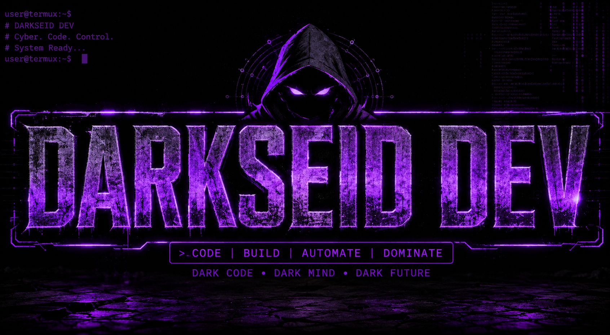

# ⚡ CDM TECH • DARKSEID 👑

> **Banner Tool for Termux — Dark • Hacker • Cyber Tech**

<p align="center">
  
</p>

## 🛡️ Présentation

**CDM TECH / DARKSEID** est un outil Bash conçu pour **Termux** afin de personnaliser l'affichage du terminal avec des bannières stylées.

Le script propose plusieurs styles `figlet`, un nom personnalisé, des bannières personnalisées, un mode aléatoire et l'activation automatique de la bannière au démarrage de Termux.

## ✨ Fonctionnalités

- ⚡ Bannière **CDM TECH / DARKSEID**
- 🎨 **20 styles** de bannière
- ✏️ Nom de bannière personnalisable
- 🖥️ Création de bannière personnalisée
- 🎲 Mode aléatoire
- 🔄 Bannière persistante au démarrage de Termux
- 🧹 Activation / désactivation du mode persistant
- 📦 Installation automatique de `figlet`
- 🔴 Interface dark / hacker / cyber-tech
- 🛠️ Fonctionne directement depuis le terminal Termux

## 📂 Structure

```text
CDM-TECH-BANNER/
├── banner.png
├── cdm_tech_darkseid_banner.sh
└── README.md
